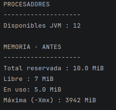
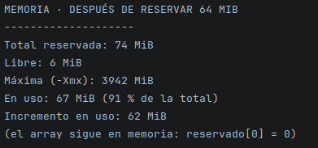
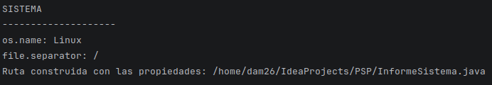
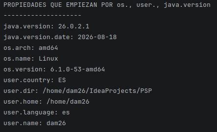
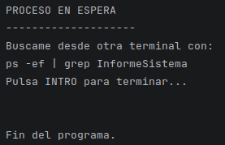
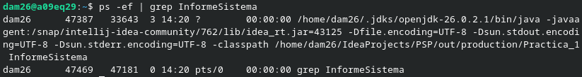
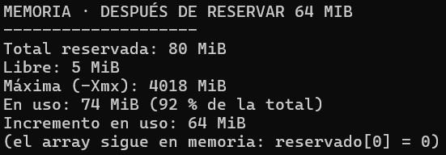
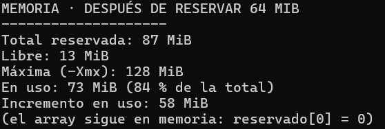

# Radiografia del Sistema

## Programación de Servizos E Procesos

### DAM 2º

### Gabriela Martinez Menegatty

---
## Apartado 1.

Dado el siguiente programa:

## Apartado 2.

Al realizar el comando:

`ps -ef | grep InformeSistema` 

en bash, nos arrojó el siguiente resultado: 

1. PID: 4738
2. PPID: 3433

3. Ruta multiplataforma

El programa obtiene el sistema operativo mediante la propiedad `os.name`, 
el separador de rutas mediante `file.separator` y el directorio 
personal mediante `user.home`.

En la ejecución de Linux, la ruta dada es:

`/home/dam26/IdeaProjects/PSP/InformeSistema.java`

En la ejecución de Windows, la ruta dada es:

`C:\Users\gabri\IdeaProjects\PSP\InformeSistema.java`

La diferencia es que cada sistema operativo utiliza un 
separador de rutas diferente y tiene una ubicación diferente para el directorio 
personal del usuario. Linux utiliza `/`, mientras que Windows utiliza `\`.

El codigo logra funcionar en diferentes sistemas operativos; 
ya que son propiedades predeterminadas, no escritas al momento.

4. Comparación de memoria

Se realizaron dos ejecuciones del programa desde PowerShell: una ejecución normal y 
otra utilizando la opción `-Xmx128m`.

| Dato | Ejecución normal | `-Xmx128m` |
|---|---:|---:|
| Total reservada | 80 MiB | 87 MiB |
| Libre | 5 MiB | 13 MiB |
| En uso | 74 MiB | 73 MiB |
| Máxima (-Xmx) | 4018 MiB | 128 MiB |
| Incremento en uso | 64 MiB | 58 MiB |

La diferencia más importante se encuentra en la memoria máxima disponible. 
En la ejecución normal, la memoria máxima es de 4018 MiB, 
mientras que al utilizar el comando `-Xmx128m` se establece un límite máximo de 128 MiB.

Las cifras de memoria total reservada, libre y en uso también 
varían entre las dos ejecuciones. 

En la ejecución normal se utilizaron 74 MiB de los 80 MiB reservados, 
mientras que con `-Xmx128m` se utilizaron 73 MiB de los 87 MiB reservados.

Ejecución Normal.

`-Xmx128m`

## Apartado 3. 

## Qué tipo de programación encaja.

### a) Un servidor web que atiende 500 peticiones a la vez en una máquina de 8 núcleos.

**Tipo: programación concurrente y paralela.**

Es concurrente porque el servidor tiene que gestionar 
muchas peticiones que están sucediendo al mismo tiempo.

También puede ser paralela porque la máquina tiene 8 núcleos y 
algunas de esas tareas pueden ejecutarse simultáneamente en diferentes núcleos.

**Inconveniente:** gestionar muchas peticiones a la vez 
puede aumentar el consumo de memoria y CPU y provocar una saturación del sistema.

### b) Renderizar una película de animación en un plazo de tres meses.

**Tipo: programación paralela.**

El proceso de renderizado puede dividirse en muchas tareas. Estas tareas 
pueden ejecutarse simultáneamente en distintos núcleos de la 
máquina para reducir el tiempo total de renderizado.

**Inconveniente:** no todas las tareas tienen por qué poder ejecutarse 
independientemente, por lo que algunas partes del proceso pueden tener que 
esperar a otras.

### c) Una app de móvil que descarga un fichero mientras seguimos navegando.

**Tipo: programación concurrente.**

La aplicación está realizando dos tareas que coexisten: descargar un fichero y 
permitir que el usuario siga navegando.

Mientras la descarga está esperando datos de la red, la aplicación puede 
continuar realizando otras tareas. Por eso encaja con la programación concurrente.

**Inconveniente:** hay que gestionar correctamente las diferentes tareas para 
evitar que una de ellas bloquee la aplicación o interfiera con las demás.

### d) Un cálculo que no cabe en la RAM de un solo equipo.

**Tipo: programación distribuida.**

Si el cálculo no cabe en la memoria de un único equipo, es necesario repartir 
los datos o el trabajo entre varias máquinas. Cada máquina dispone de su 
propia memoria y las máquinas tienen que comunicarse entre ellas.

**Inconveniente:** la comunicación entre las diferentes máquinas puede
ser dificil y aumenta el tiempo de ejecución. Además, un problema de 
comunicación o un fallo en una máquina puede afectar al cálculo.

