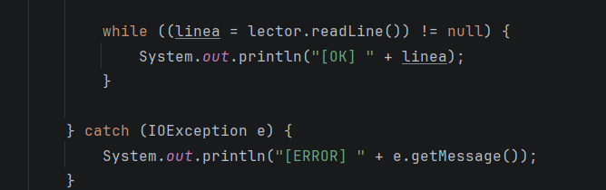
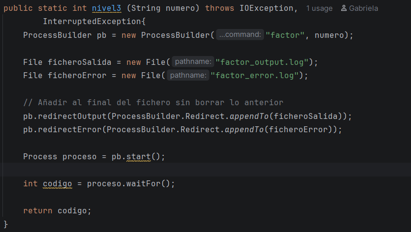
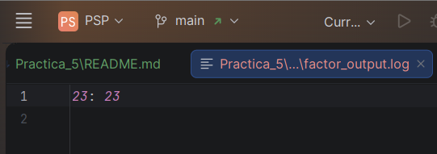
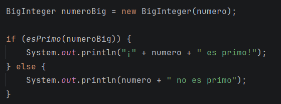

# Auditoría Cósmica: El Detector de Primos

## Programación de Servizos E Procesos

### DAM 2º

### Gabriela Martinez Menegatty

---

### Nivel 1

Dado el programa principal, los resultados de la 
primera prueba son lso siguientes.

| Valor |                            Salida de Factor | Código de salida |
|-------|--------------------------------------------:|-----------------:|
| 360   |360: 222335 |                0 |
| 1     |1: |                0 |
| 17    |17: 17 |                0 |
| hola  |hola: invalid digit found in string |                1 |
| -5    |error: unexpected argument '-5' found |                1 |

### Nivel 2

Consta de Agregarle al programa la mejoría de saber 
si es válido o un error el proceso
que se quiere consultar.

### Nivel 3 

Este nivel se basa en guardar el resultado de la consulta
en un fichero, de error o de salida.

### Nivel 4

El último nivel es para saber si un número es primo o no.
Cuando el número escogido salga por consola, saldrá a su vez
un mensaje que dirá si es o no es primo.

### Conclusión 

Se hicieron todos los niveles.

