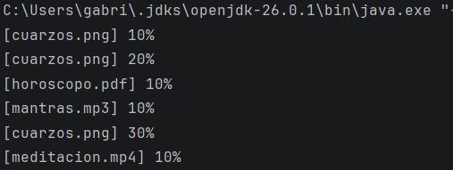
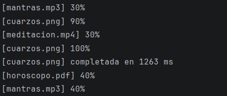
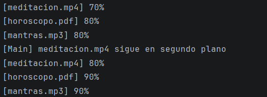
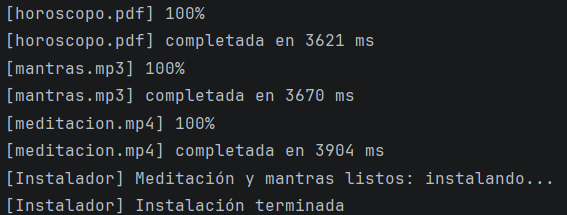
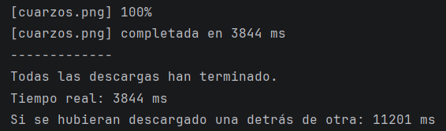
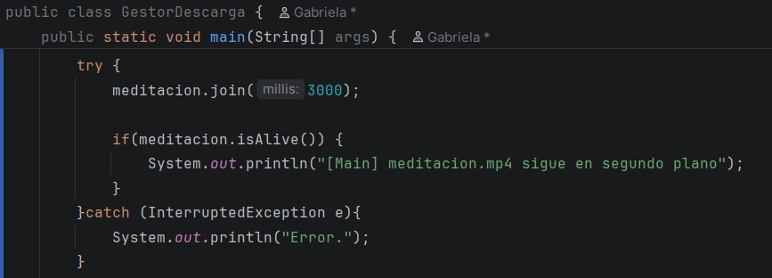
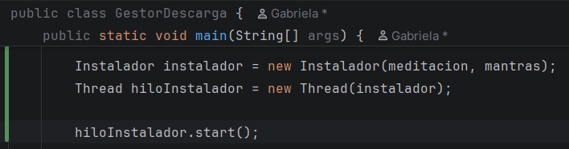
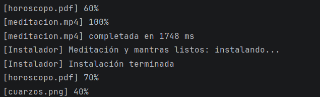

# Descargas Cuánticas: el gestor de Don Magufo

## Programación de Servizos E Procesos

### DAM 2º

### Gabriela Martinez Menegatty

---

### Nivel 1

La clase `Descarga` extiende de `Thread` y representa una descarga
independiente.

Cada descarga realiza 10 bloques y muestra su porcentaje de progreso.
Cada bloque tiene un tiempo aleatorio entre 100 y 500 milisegundos.

La clase `GestorDescargas` contiene el método `main`.

Crea las cuatro descargas, inicia los hilos y espera a que terminen
mediante `join()`.

También calcula el tiempo real de ejecución y la suma de los tiempos
individuales de las descargas.

| Ejecución | Descarga más lenta | Tiempo real (ms) | Suma (ms) |
|-----------|-------------------:|-----------------:|-----------|
| 1         |        mantras.mp3 |          4888 ms | 12822 ms  |
| 2         |      horoscopo.pdf |          4002 ms | 9857 ms   |
| 3         |        cuarzos.png |          3844 ms | 11201 ms  |

---

Preguntas:

**¿Por qué el tiempo real es menor que la suma?**

El tiempo real es menor porque representa cada descarga por separado.

La suma representa el tiempo total de las cuatro descargas.

**¿Qué ocurriría si hacemos start() y join() en el mismo bucle?**

Las descargas se ejecutarían una detrás de otra, porque el programa
esperaría a que terminara una descarga antes de iniciar la siguiente.

### Nivel 2

No realizado.

### Nivel 3

Este nivel se encarga de la descarga de `meditacion.mp4` y `mantras.mp3`, 
implementa `Runnable`.

El programa espera como máximo 3 segundos por `meditacion.mp4`.
Si todavía está descargándose, muestra un aviso y continúa sin
cancelar la descarga.

Las demás descargas continúan por detrás sin problema.

---

---

